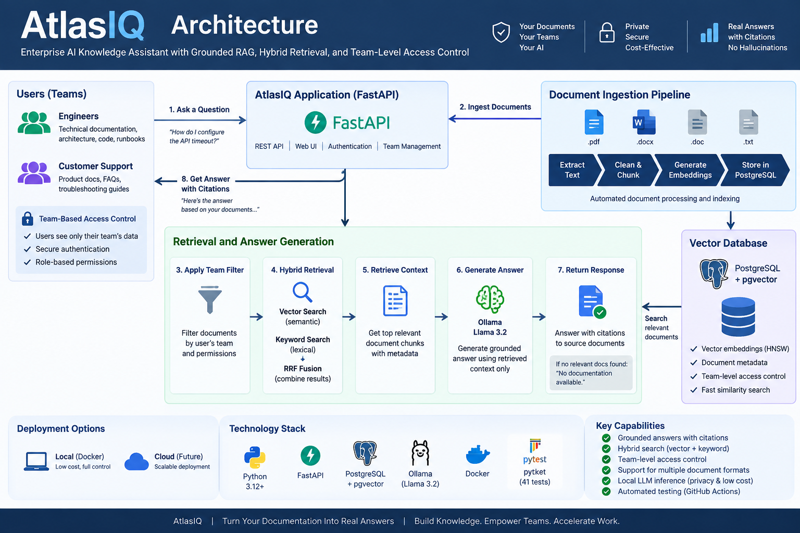

# AtlasIQ
[](https://github.com/babusriharsha/atlasiq/actions/workflows/ci.yml)
**Enterprise AI Knowledge Assistant with Grounded RAG, Hybrid Retrieval, Team-Level Access Control, and Local LLM Inference**

AtlasIQ is a production-oriented Retrieval-Augmented Generation (RAG) application that enables engineering and customer-support teams to ask questions against internal company documentation and receive grounded answers with source citations.

The project demonstrates an end-to-end AI engineering workflow: document ingestion, text extraction, chunking, embeddings, vector search, hybrid retrieval, grounded LLM generation, evaluation, observability, automated testing, database migrations, and containerized deployment.

## Why AtlasIQ?

Organizations often have valuable technical knowledge distributed across internal documents. Finding the correct information can be slow, and general-purpose AI systems may generate answers that are not grounded in company documentation.

AtlasIQ addresses this by:

* answering questions using retrieved company documentation
* returning source information with generated answers
* isolating retrieval by team
* returning a clear response when relevant documentation is unavailable
* collecting user feedback and corrections
* tracking query and feedback metrics
* supporting reproducible containerized deployment

## Architecture


## Demo

AtlasIQ answers questions using retrieved company documentation and returns the source used to generate the answer.

### Example question

```bash
curl -X POST http://localhost:8002/ask \
  -H "Content-Type: application/json" \
  -d '{
    "question": "What is AtlasIQ?",
    "team": "engineering"
  }'
```

### Grounded response

```json
{
  "answer": "AtlasIQ is an enterprise AI knowledge assistant for engineering teams.",
  "sources": [
    {
      "document_id": 1,
      "filename": "docker-test.txt",
      "chunk_index": 0
    }
  ]
}
```

This demonstrates the core RAG flow:

**Question + Team → Hybrid Retrieval → Retrieved Context → Local LLM → Grounded Answer + Citation**

## Core Capabilities

### Document ingestion

AtlasIQ accepts supported company documents, extracts their text, splits the content into chunks, generates embeddings, and stores the resulting knowledge in PostgreSQL.

Current upload support:

* PDF
* DOCX
* TXT

Uploads include filename sanitization, UUID-based storage names, file-size validation, unsupported-file rejection, and cleanup when ingestion fails.

### Semantic vector search

Document chunks are embedded using `all-MiniLM-L6-v2`, producing 384-dimensional embeddings.

Embeddings are stored using PostgreSQL with pgvector and indexed using an HNSW index for efficient cosine-similarity retrieval.

### Hybrid retrieval

AtlasIQ combines:

* semantic vector search
* keyword search
* Reciprocal Rank Fusion (RRF)

This allows retrieval to benefit from both semantic similarity and exact textual matches.

### Team-level isolation

Documents are associated with teams such as Engineering or Customer Support.

Retrieval is filtered by team so a query only searches documentation available to the requesting team.

### Grounded generation

Retrieved chunks are supplied as context to a locally hosted LLM using Ollama and Llama 3.2 3B.

Answers include source metadata such as:

* document ID
* filename
* chunk index

If sufficiently relevant documentation cannot be found, AtlasIQ avoids inventing an answer and returns an appropriate no-documentation response.

### Feedback and correction

Users can mark generated answers as correct or incorrect and optionally provide a correction.

This creates a foundation for evaluating and improving system quality over time.

### Metrics and observability

AtlasIQ records query information and exposes metrics for evaluating system behavior, including feedback and query performance.

## Technology Stack

| Layer               | Technology              |
| ------------------- | ----------------------- |
| API                 | FastAPI                 |
| Language            | Python 3.12             |
| Database            | PostgreSQL 16           |
| Vector Database     | pgvector                |
| ORM                 | SQLAlchemy              |
| Database Migrations | Alembic                 |
| Embeddings          | SentenceTransformers    |
| Embedding Model     | all-MiniLM-L6-v2        |
| Vector Dimensions   | 384                     |
| Vector Index        | HNSW                    |
| Retrieval           | Vector + Keyword + RRF  |
| LLM Runtime         | Ollama                  |
| LLM                 | Llama 3.2 3B            |
| Testing             | pytest + pytest-cov     |
| Containers          | Docker + Docker Compose |

## API Endpoints

| Endpoint                   | Method | Purpose                           |
| -------------------------- | ------ | --------------------------------- |
| `/health`                  | GET    | Application/database health       |
| `/documents`               | GET    | List documents                    |
| `/documents`               | POST   | Create document metadata          |
| `/documents/{document_id}` | GET    | Retrieve document                 |
| `/documents/{document_id}` | PUT    | Update document                   |
| `/documents/{document_id}` | DELETE | Delete document                   |
| `/documents/upload`        | POST   | Upload and ingest document        |
| `/ask`                     | POST   | Ask a grounded RAG question       |
| `/feedback`                | POST   | Record answer feedback/correction |
| `/metrics/feedback`        | GET    | Retrieve feedback metrics         |
| `/metrics/queries`         | GET    | Retrieve query metrics            |

Interactive API documentation is available through FastAPI at `/docs` while the application is running.

## Example

Question:

```json
{
  "question": "What is AtlasIQ?",
  "team": "engineering"
}
```

Example response:

```json
{
  "answer": "AtlasIQ is an enterprise AI knowledge assistant for engineering teams.",
  "sources": [
    {
      "document_id": 1,
      "filename": "docker-test.txt",
      "chunk_index": 0
    }
  ]
}
```

The answer is generated from retrieved documentation rather than unrestricted model knowledge.

## Running with Docker

### Prerequisites

Install:

* Docker
* Docker Compose

### Environment configuration

Create a `.env` file in the project root:

```env
POSTGRES_DB=atlasiq
POSTGRES_USER=atlasiq_user
POSTGRES_PASSWORD=choose_a_local_password
```

Do not commit `.env`.

### Start AtlasIQ

```bash
docker compose up -d --build
```

The stack starts:

* AtlasIQ FastAPI service
* PostgreSQL with pgvector
* Ollama

PostgreSQL includes a health check, and the API waits for the database to become healthy before starting.

Alembic migrations run automatically when the API container starts.

### Install the local LLM

On first startup:

```bash
docker compose exec ollama ollama pull llama3.2:3b
```

The Ollama model is persisted in a Docker volume.

### Verify services

```bash
docker compose ps
```

Check application health:

```bash
curl http://localhost:8002/health
```

Expected response:

```json
{
  "status": "healthy",
  "database": "connected"
}
```

## Upload a Document

```bash
curl -X POST \
  -F "team=engineering" \
  -F "file=@example.txt" \
  http://localhost:8002/documents/upload
```

AtlasIQ will:

1. validate the upload
2. store the document
3. extract text
4. split the text into chunks
5. generate embeddings
6. persist chunks and vectors in PostgreSQL/pgvector

## Ask a Question

```bash
curl -X POST http://localhost:8002/ask \
  -H "Content-Type: application/json" \
  -d '{"question":"What does the documentation say?","team":"engineering"}'
```

AtlasIQ performs hybrid retrieval, constructs grounded context, sends that context to the local LLM, and returns the answer with its sources.

## Database Migrations

AtlasIQ uses Alembic for reproducible schema management.

The initial migration creates:

* documents
* chunks
* feedback
* query logs
* pgvector extension
* HNSW vector index

The Docker API startup automatically executes:

```bash
alembic upgrade head
```

This allows a fresh PostgreSQL database to be initialized without manually creating application tables.

## Testing

Run:

```bash
pytest
```

Run the test suite with coverage:

```bash
pytest --cov=app --cov-report=term-missing
```

The project currently contains **41 automated tests** with approximately **98% application-code coverage**.

Tests cover areas including:

* health/database connectivity
* document operations and ingestion
* chunking
* vector retrieval
* hybrid retrieval and ranking
* RAG behavior
* LLM integration boundary
* feedback
* evaluation
* metrics
* database configuration

## Reproducibility

The Dockerized system has been validated from fresh Docker volumes.

A clean environment can:

1. create PostgreSQL
2. enable pgvector
3. execute Alembic migrations
4. create the application schema
5. create the HNSW vector index
6. start FastAPI
7. start Ollama
8. ingest a document
9. generate embeddings
10. retrieve relevant context
11. generate a grounded answer
12. return source citations

## Security and Production Considerations

AtlasIQ currently demonstrates team-scoped retrieval at the application layer. A real enterprise deployment should additionally integrate authenticated user identities and authorization rather than trusting a client-supplied team value.

Other production extensions could include:

* centralized secrets management
* TLS termination
* rate limiting
* structured application logging
* distributed tracing
* object storage
* managed PostgreSQL
* background ingestion workers
* CI/CD
* cloud deployment
* enterprise identity integration

## Project Goals

AtlasIQ was built as an end-to-end AI engineering project rather than a standalone chatbot demo.

It demonstrates practical experience with:

* RAG architecture
* embedding pipelines
* vector databases
* retrieval design
* LLM integration
* grounding and citations
* evaluation and feedback
* relational data modeling
* API development
* automated testing
* database migrations
* Docker containerization
* multi-service orchestration
* production-oriented failure handling

## Status

**Local containerized version: functional and tested.**

The current version is designed as a local-first implementation. Cloud architecture and deployment are intentionally separate future stages rather than dependencies of the local system.

## License

No open-source license has been assigned yet.
